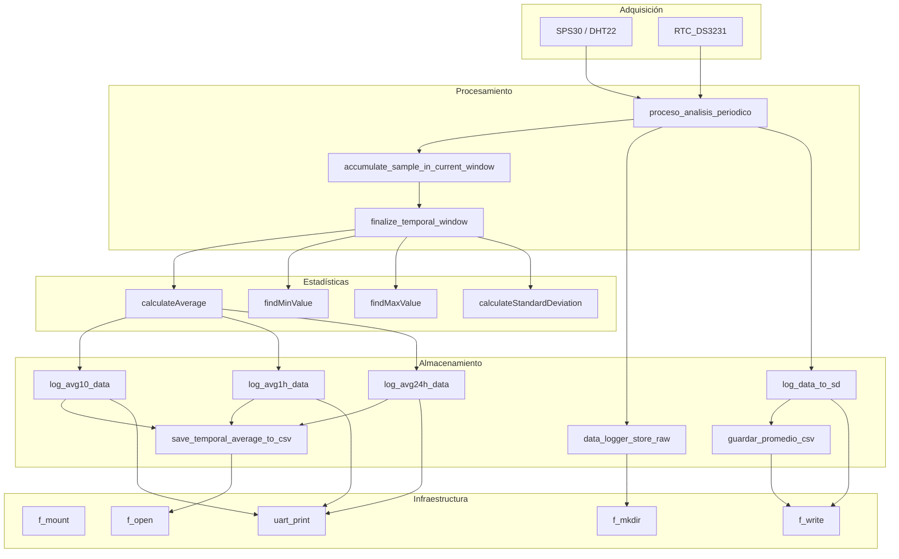

# Módulo `data_logger` - Sistema de Registro para Medición de Material Particulado (PM2.5)

## 📌 Descripción General

El módulo `data_logger` tiene como objetivo central registrar de forma estructurada y eficiente
los datos de concentración de material particulado (PM1.0, PM2.5, PM4.0 y PM10), temperatura y humedad
en una tarjeta microSD. Está diseñado para operar sobre un microcontrolador STM32F429ZI en un sistema bare-metal
sin RTOS, utilizando FATFS y sincronización temporal vía RTC DS3231.

---

## 🧭 Funcionalidades Principales

- Inicialización y montaje de sistema FAT32 en microSD.
- Almacenamiento de datos crudos y promedios temporales.
- Gestión de buffers circulares por frecuencia:
  - Alta frecuencia (cada 10s o 1min)
  - Promedios horarios
  - Promedios diarios
- Cálculo estadístico: media, máximo, mínimo, desviación estándar.
- Escritura automática en archivos `/AVG10/`, `/AVG60/`, `/AVG24/`.
- Formateo de líneas CSV con timestamp ISO8601.
- Visualización en UART para depuración y monitoreo.

---

## 📦 Estructura de Archivos

```
/YYYY/MM/DD/
├── RAW.csv                  # Datos crudos
├── avg10.csv                # Promedios cada 10 minutos
├── avg60.csv                # Promedios cada 1 hora
└── avg24.csv                # Promedios cada 24 horas
```

---

## 🧩 Estructuras de Datos

| Estructura             | Descripción                                         |
|------------------------|-----------------------------------------------------|
| `MedicionMP`           | Datos crudos con timestamp, ID sensor, PM, T, H     |
| `PMDataAveraged`       | Promedios estadísticos de PM2.5                     |
| `TimeWindow`           | Ventana activa de 10 minutos para acumular muestras |
| `TimeSyncedAverage`    | Resultado con estadísticas y timestamp              |
| `BufferCircular`       | FIFO para crudos y promedios                        |

---

## 🔁 Flujo General del Sistema

1. Se obtiene una medición de PM2.5 desde el sensor.
2. `proceso_analisis_periodico()` almacena el dato en una ventana de 10 minutos.
3. Si han pasado 10 min (según RTC), se:
   - Calcula el promedio
   - Se imprime por UART
   - Se guarda en `/AVG10/avg10.csv`
4. Cada 6 promedios → se calcula un promedio horario → `/AVG60/`
5. Cada 24 promedios horarios → se calcula un promedio diario → `/AVG24/`

---

## 📜 Diagrama de Flujo Modular



---

## ✍️ Autoría

- **Autor:** Luis Gómez
- **Fecha de creación:** 10 de mayo de 2025
- **Licencia:** GNU GPLv3
