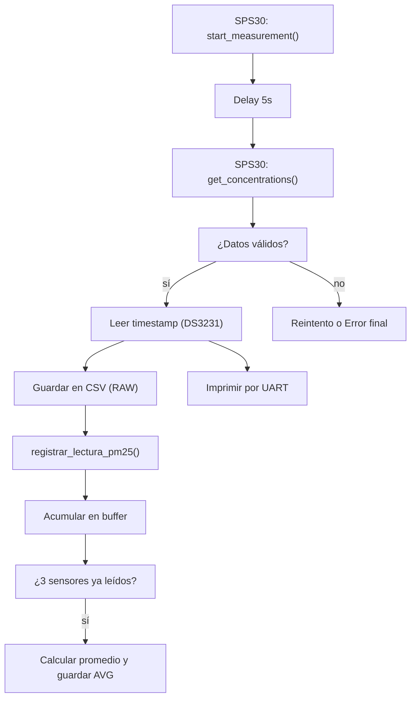

¡Perfecto! Basándome en tu estilo de documentación en Markdown y el contenido de `proceso_observador.h`, te dejo una propuesta clara, estructurada y lista para integrar como archivo `proceso_observador.md` o sección en tu documentación principal:

---

# 📡 Módulo `proceso_observador` — Adquisición y Validación de Datos PM2.5

## 📌 Descripción General

El módulo `proceso_observador` implementa la lógica de adquisición y validación de datos provenientes de sensores de material particulado **SPS30** y sensores de **temperatura/humedad DHT22**.

Es parte del sistema embebido desarrollado para una tesis en FIUBA, con el objetivo de monitorear concentraciones de **PM1.0, PM2.5, PM4.0 y PM10** en entornos urbanos. Permite:

* Obtener datos confiables de concentración de partículas,
* Validar su rango físico,
* Asociarlos a condiciones ambientales,
* Guardarlos en microSD (formato `.csv`),
* Imprimir por UART,
* Acumular y promediar los datos cada 10 min, 1 h, 24 h.

---

## 🧭 Funcionalidades

* Ciclo completo de adquisición SPS30 (inicio → espera → lectura → validación).
* Sincronización con RTC (DS3231).
* Registro estructurado de mediciones crudas.
* Captura de contexto ambiental: temperatura y humedad con DHT22.
* Acumulación de lecturas en buffer para cálculo estadístico periódico.
* Reintentos automáticos ante fallos.

---

## 🧩 Flujo de Ejecución



---

## 🧪 Validaciones y Reintentos

* Cada lectura de PM se valida contra umbrales: `0.0 ≤ PM ≤ 1000.0 µg/m³`.
* Se permiten hasta `3 reintentos` por sensor si la lectura es inválida.
* Si el RTC no responde, se notifica por UART.

---

## 📦 Estructuras y Variables

| Elemento                 | Tipo / Rol                               |
| ------------------------ | ---------------------------------------- |
| `SPS30`                  | Objeto sensor de partículas              |
| `DHT22`                  | Sensor ambiental auxiliar                |
| `ParticulateData`        | Estructura con PMs + T° y HR + timestamp |
| `registrar_lectura_pm25` | Agrega dato de PM2.5 a buffer circular   |
| `proceso_observador_*`   | Funciones que gestionan adquisición      |

---

## 🔧 Parámetros Configurables

| Macro                        | Valor       | Descripción                           |
| ---------------------------- | ----------- | ------------------------------------- |
| `NUM_REINT`                  | `3`         | Reintentos ante falla                 |
| `CONC_MIN_PM`, `CONC_MAX_PM` | `0`, `1000` | Rango aceptable de PMs                |
| `DELAY_MS_SPS30_LECTURA`     | `5000`      | Delay entre inicio y lectura de SPS30 |

---

## 📚 Funciones Públicas

| Función                          | Descripción breve                                       |
| -------------------------------- | ------------------------------------------------------- |
| `proceso_observador()`           | Ejecuta adquisición SPS30 usando timestamp actual (RTC) |
| `proceso_observador_with_time()` | Igual que anterior pero usando timestamp externo        |
| `proceso_observador_3PM_2TH()`   | Usa timestamp externo y mediciones de 2 sensores DHT22  |
| `registrar_lectura_pm25()`       | Registra PM2.5 individual y actualiza buffers           |

---

## 📜 Ejemplo de uso básico

```c
SPS30 sensor;
sps30_init(&sensor, ...); // UARTx, funciones
if (proceso_observador(&sensor, 1, 22.3f, 55.1f)) {
    uart_print("Medición SPS30 ID 1 registrada correctamente.\n");
}
```

---

## ✍️ Autoría

* **Autor**: Luis Gómez
* **Fecha**: 04 de mayo de 2025
* **Licencia**: [GNU GPLv3](https://www.gnu.org/licenses/gpl-3.0.html)

---
